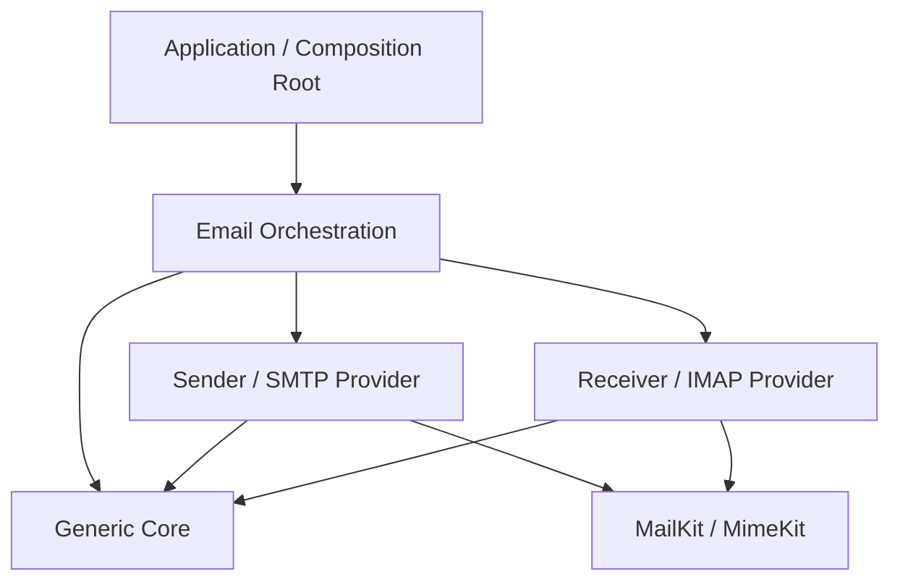

# Fluent Mail Architecture and Implementation Plan

## Current Focus

Prioritize usable fluent, composable email. Do not expand this phase into immutable envelope redesign, ordered header nodes, HTML sanitization, or general rewriting. AST code is not part of the fluent/send path; further work on it is deferred to phase 7.

## Executive Architectural Blueprint

Make `MailKitSimplified.Generic` the dependency-free domain layer and `MailKitSimplified.Email` the composition and provider-integration layer. Represent content with one authoritative Email AST, keeping delivery-envelope recipients separate from rendered headers. Typed nodes support `IEmailVisitor` double-dispatch; C# pattern matching supports structural validation and immutable transformations. An email AST models message structure, not HTML syntax: HTML sanitization requires a dedicated parser outside the domain.

`GenericEmailBuilder` produces validated snapshots using `To()`, `Subject()`, `Body()`, `Attach()`, and `Build()`, without opening files or connecting to servers. Host-style registration configures providers; only `SendAsync()` or `EnqueueAsync()` initiates execution. Explicit adapters such as `MimeKitAstVisitor` and `ToMimeMessage()` translate domain content into provider payloads. Cloud adapters report unsupported capabilities instead of silently losing content. Dependency-minimal core libraries dual-target `netstandard2.0;net10.0`; infrastructure and applications target `net10.0`, with platform-specific variants where necessary.

SMTP and IMAP connections are stateful resources requiring exclusive leases. A bounded `MailKitConnectionPool<TClient>` reuses authenticated connections; `PooledClientLease<T>` implements `IAsyncDisposable` and uses `Interlocked.Exchange` for exactly-once release. `ConcurrentBag` and atomic operations support efficient reuse, but do not make the entire pool lock-free. Capacity control, health checks, and shutdown coordination remain necessary. IMAP folder selection and IDLE sessions need distinct lifecycle rules.

A unified `IEmailSender` supports MailKit, cloud, decorated, and null implementations. Compose telemetry and resilience decorators. `Microsoft.Extensions.Http.Resilience` applies to cloud HTTP clients; SMTP uses an explicit Polly resilience pipeline that accounts for ambiguous delivery and duplicate risks. Bounded `System.Threading.Channels` queues feed `BackgroundService` workers with backpressure, but are not durable delivery stores. Pin the .NET SDK and use xUnit with Microsoft.Testing.Platform v2 for reproducible direct `dotnet test --project` execution.

## Project Boundaries Inspired by Zuemail

Zuemail demonstrates the important dependency direction: `Zuemail.MailKit` references `Zuemail.Core`, while Core does not reference MailKit. Core owns message/contact models, builder/sender/handler contracts, neutral `EmailOptions`, and validation strategies. MailKit owns `MailOptions`/`SmtpOptions`, `SecureSocketOptions`, SMTP capabilities, protocol logging, and client connection/authentication. `Zuemail.Gateway` is a separate project with its own abstractions/models/services; it currently has no project reference to Core, so it is not evidence of an existing Core-to-Gateway dependency chain.

Use the same separation without renaming or splitting projects unnecessarily:

| Project | Intended responsibility | Dependencies and exclusions |
| --- | --- | --- |
| `Zue.Generic` | Core contracts; the single `Models.GenericEmail` model; contacts; dictionary headers; typed attachment descriptors; neutral option data; transport-free fluent composition and validation contracts. | BCL-only target. No MailKit/MimeKit, configuration binding, logging, DI registration, hosted workers, or client construction. |
| `Zue.MailKit` | MailKit SMTP provider, MIME mapping/materialization, provider-specific options, connection/authentication, and later pooled leases. Also includes MailKit IMAP provider, folder/session behavior, provider options, and generic receive mapping where needed. | References Generic when implementing its contracts, plus MailKit/MimeKit. Never depends on Email orchestration. Existing native MailKit APIs can remain alongside the generic adapter. References Generic where it uses neutral contracts, plus MailKit/MimeKit. Never depends on Email orchestration or the SMTP provider. |
| `Zue.Email` | Application orchestration/facade, send/reset handler, defaults/templates, configuration/DI integration, and later decorators/queues. | References Generic and selected providers. Provider payloads stay behind adapters; the public generic workflow must not require `MimeMessage` or `SmtpClient`. |
| Samples/apps | Composition root choosing accounts, providers, defaults, and hosting behavior. | Reference only the packages needed for the workflow; never push app-specific policy into Generic. |

The existing MIME converter is currently in Email, and Sender/Receiver currently expose native MailKit APIs. Moving generic MIME mapping into the SMTP provider is a planned boundary correction, not an already completed migration. Keep the current working path until that move has focused tests. Do not add a new Core/Hosting/MailKit project merely to imitate names; introduce another assembly only when an independent provider or packaging requirement warrants it.



This diagram is the intended dependency direction, not a claim that every project reference already exists. Provider and orchestration dependencies must never point back into Generic.

### Design Ideas to Adopt

- Keep one email model in `Models` and behavioral builders/handlers in `Services`. `MailKitSimplified.Generic.Services.GenericEmail` has been removed; both the builder and legacy writer now use `Models.GenericEmail` directly.
- Separate construction from execution, following Zuemail's `EmailMessageBuilder` versus `EmailMessageHandler`. Keep `GenericEmailBuilder` free of a sender; evolve the send-capable legacy `GenericEmailWriter` into a handler in Email that delegates to a sender contract in Generic.
- Add clone-safe templates/defaults inspired by `SaveAsTemplate()` and `Template`. Compose defaults into independent builders; after successful send reset from an independent template copy. Define retention/reset behavior on failed, cancelled, and `TrySendAsync(false)` outcomes explicitly.
- Use a small sender contract similar to `ISender<T>` behind the handler. Do not require every transport implementation to expose mutable writer state or copying; DI/pools own transport lifetimes.
- Introduce an optional validation strategy inspired by `IValidationStrategy<T>`. Provide a safe default when no strategy is supplied, respect failure results before sending, propagate cancellation for async validation, and do not mutate the message to manufacture addresses.
- Keep shared host/port/credentials/optional `TimeSpan` timeout values neutral, as in `EmailOptions`. Add provider-specific options for MailKit TLS, authentication mechanisms, capabilities, and protocol logging, as in `MailOptions`/`SmtpOptions`. Binding and fluent setters belong to the configuration/provider boundary rather than client objects stored in domain options.
- Offer action-based and configuration-section registration inspired by `ConfigureEmail()` and `ConfigureDefaultEmail()`, with named accounts/templates where needed. Keep Microsoft.Extensions integration out of the dependency-free domain project.

### Details Not to Copy Literally

- Zuemail Core is vendor-neutral, but not dependency-free: it currently references configuration/options/logging, CommunityToolkit, and filesystem packages. Adopt its provider boundary while keeping our planned Generic domain leaner.
- Avoid mutable shared static `Default` instances and `MemberwiseClone()` for messages/options with mutable collections. Factories or independent snapshots must prevent account/template leakage between callers.
- `EmailOptions.Create()` must not mutate a shared default; host-only values must set Host, and host/port parsing must handle IPv6 deliberately. Redact credentials and validate timeout-to-millisecond conversion at the provider boundary.
- Do not put `Lazy<SmtpClient>` or connect/authenticate methods on neutral options. Zuemail's `SmtpClient` property constructs a new `Lazy` per access; our client factory/pool must own creation, reuse, and disposal explicitly.
- Do not copy unsafe authentication-delegate casts between `ISmtpClient` and `IMailService`; adapt delegates with typed wrappers in the provider.
- Keep optional validation genuinely optional, check its returned result, and avoid debug-only address mutation or unconditional reset on unsuccessful sends.

## Baseline at Start

Status recorded on 2026-10-09. Checked boxes mean implemented and verified, not simply designed.

- Phase 1 is reported complete by the maintainer. `global.json` selects Microsoft.Testing.Platform and existing tests target `net10.0`. Remaining reconciliation: no SDK pin, legacy VSTest packages remain, Generic/Email declare `TargetFramework` alongside inherited `TargetFrameworks`, and Generic still has infrastructure dependencies. Do not repeat a framework migration without first checking these details.
- Phase 2 had started at the baseline: generic email/contact models and SMTP options existed, but no typed AST or visitor. Two `GenericEmail` classes existed initially; the redundant Services type has now been removed in favor of Models.
- Phase 3 has started: fluent construction and MIME conversion exist. The builder exposes mutable `AsEmail`; its original `Copy()` shares the same email. MIME mapping lives inside `GenericEmailSender` and accepts untyped attachments.
- The first implementation slice adds detached `Build()` snapshots and independent `Copy()`. Legacy emails remain mutable; snapshots copy contacts, collections, and byte arrays, but borrow streams and arbitrary attachment objects. This is not yet immutable or fully replayable content.

## Phase-Based Task List

### Phase 1: Project Setup, Target Framework and Testing Platform v2

- [ ] Confirm the reported completion against an approved .NET 10 SDK pin and `rollForward` policy in `global.json`.
- [ ] Normalize framework declarations: core `netstandard2.0;net10.0`, infrastructure/tests `net10.0`, WPF `net10.0-windows`.
- [ ] Reconcile central package management and move Options, Logging, Annotations, and filesystem dependencies out of the pure domain.
- [ ] Use executable xUnit projects with an MTP v2-compatible runner; remove legacy test adapters and VSTest-only collectors.
- [ ] Verify both core TFMs and direct `dotnet test --project <TestProject.csproj>` in CI with MTP-native coverage/reporting.

### Phase 2: Generic Domain, Options and Email AST

- [x] Consolidate the generic email implementation, preserve dictionary headers and existing contacts, and add typed `EmailAttachment` contracts for core composition.
- [x] Remove the redundant `Services.GenericEmail`; have fluent factories and the legacy writer use `Models.GenericEmail` directly.
- [x] Add `IEmailAstNode`, `HeaderNode`, abstract `BodyNode`, `TextBodyNode`, `HtmlBodyNode`, `AttachmentNode`, and `MultipartContainerNode` with explicit mixed/alternative/related semantics.
- [x] Implement typed `IEmailVisitor` double-dispatch through `Accept()` and deterministic traversal; use C# switch expressions and positional/property patterns for inspection.
- [x] Add bounded structural validation for composed multipart bodies. General transformations, HTML policies, and richer inspections are deferred to phase 7.
- [ ] Separate binding-friendly neutral option data (host, port, credentials, optional timeout) from provider-specific SMTP/TLS/authentication options, following Zuemail Core/MailKit boundaries; validate via infrastructure `IValidateOptions<T>` and redact secrets. Use a record only where it fits binding and compatibility needs.

### Phase 3: Fluent Builder and Provider Mapping

- [x] Add `Compose()`, `Body(text, html)`, `Body(BodyNode)`, and typed `Attach()`; preserve independent `Build()` snapshots and existing `AsEmail`/body methods.
- [ ] Complete core input validation for envelope/header fields without replacing dictionary headers or mutable snapshots.
- [ ] Introduce a transport-independent validation strategy contract with a default implementation; respect validation failures and cancellation before provider execution.
- [ ] Add clone-safe saved templates/defaults and a separate send/reset handler over the builder and sender contract; test successful, failed, cancelled, and false-result reset policies.
- [x] Replace shallow `MemberwiseClone()` with independent builder state; test contacts, every recipient collection, headers, and byte-array attachments.
- [x] Add `ToMimeMessageAsync()` for composed bodies, dictionary headers, typed/legacy attachments, encoding, content IDs, cancellation, and message ownership; use it from the sender.
- [ ] Verify Bcc envelope/wire behavior and migrate remaining synchronous legacy conversion callers before retiring the old converter.
- [ ] Move generic MIME mapping/materialization into the SMTP provider boundary; let Email orchestration depend on generic contracts and delegate transport behavior without creating cycles.
- [x] Define replayable attachment factories and stream ownership; defer file access to cancellable MIME materialization rather than `Build()`.
- [ ] Add a concrete cloud adapter with capability checks; expose host-style provider configuration and explicit terminal `SendAsync()`/`EnqueueAsync()` execution.

### Phase 4: High-Performance Connection Pooling

- [ ] Implement bounded `MailKitConnectionPool<TClient>` with `ConcurrentBag`, async client factories, and `SemaphoreSlim`; key pools by endpoint, identity, and TLS policy.
- [ ] Implement `ValueTask<PooledClientLease<TClient>> RentAsync(CancellationToken)` and reference-type `IAsyncDisposable` leases using `Interlocked.Exchange` for exactly-once release.
- [ ] Connect/authenticate before leasing; enforce exclusive client use and discard expired, disconnected, faulted, or protocol-uncertain clients.
- [ ] Add idle/lifetime eviction and async shutdown; cover cancellation, creation failure, and return/dispose races without leaking clients or permits.
- [ ] Specify IMAP folder-state reset and dedicated IDLE leases; benchmark handshake reuse and allocation costs without claiming the complete pool is lock-free.

### Phase 5: Resilient Decorators and Null Sender

- [ ] Define `Task IEmailSender.SendAsync(GenericEmail, CancellationToken)` in Generic; separate sender execution from handler construction/template/reset behavior, with adapters for current interfaces.
- [ ] Implement MailKit/cloud senders with per-attempt leases, replayable materialization, and end-to-end cancellation.
- [ ] Add Polly retry/timeout/circuit-breaker decorators; configure `Microsoft.Extensions.Http.Resilience` only on HTTP providers and avoid stacked retries.
- [ ] Classify transient, permanent, cancelled, and ambiguous outcomes; avoid blind SMTP retries after possible acceptance and use supported cloud idempotency keys.
- [ ] Register telemetry/resilience in documented order; provide cancellation-aware `NullEmailSender` with explicit dry-run status and privacy-safe logging.

### Phase 6: Asynchronous Channel Pipelines

- [ ] Create bounded `Channel<QueuedEmail>` with immutable snapshots, correlation metadata, cancellation-aware `ValueTask` enqueue, and explicit wait/reject backpressure.
- [ ] Consume via `BackgroundService.ReadAllAsync()` with bounded workers and DI lifetimes appropriate to each decorated sender.
- [ ] Separate queued execution deadlines from HTTP request tokens; own or durably reference attachment content before queue acceptance.
- [ ] Implement completion, graceful drain, shutdown deadlines, failure routing, and metrics; isolate per-message failures without swallowing cancellation.
- [ ] Document process-crash loss and acceptance-versus-delivery semantics; define an outbox/broker boundary for durable workloads.

### Phase 7: DI, Tests and Documentation

- [ ] Revisit `EmailAstRewriter`, link rewriting, HTML sanitization, richer inspections, and optional immutable address/envelope/header contracts after the core sending workflow is complete.
- [ ] Add host/service registration for providers, configuration binding, `ValidateOnStart()`, pools/queues, decorators, and hosted workers.
- [ ] Add action/configuration overloads for account options and default message templates, inspired by Zuemail's registrations; keep DI dependencies in Email/provider integration, not Generic.
- [ ] Add architecture checks for the documented dependency direction and domain package/public-type exclusions; ensure providers never reference Email orchestration.
- [ ] Add xUnit tests for AST traversal/pattern matching, MIME/cloud mapping, snapshot isolation, replay/disposal, TLS options, and domain dependency boundaries.
- [ ] Add deterministic race tests for `Interlocked.Exchange`, exclusive leasing, limits, cancellation, retries, shutdown, and Channel draining/backpressure.
- [ ] Add local SMTP/IMAP and cloud HTTP contract tests using direct MTP v2 `dotnet test --project` execution, filters, and coverage.
- [ ] Document fluent usage, deferred execution, migration, AST visitors, provider registration, dry runs, retry ambiguity, durability, and measured throughput.

## Ordered Route to the End of Phase 3

1. Establish builder isolation first. Add `Build()` and independent `Copy()` without changing `AsEmail` or performing I/O. Test mutable contacts and byte arrays; explicitly retain borrowed stream semantics until typed attachments replace them.
2. Use only `Models.GenericEmail`; the redundant Services model is removed. Keep existing contacts and dictionary headers; use one composed body tree with legacy text/HTML setters as adapters.
3. Define replayable attachment sources (bytes and fresh-stream factories), ownership, file-path behavior, MIME metadata, and cancellation. Reject unsupported arbitrary objects in the new typed API while isolating legacy handling.
4. Implement mixed/alternative/related body composition and basic structural validation. Defer general immutable rewrites and content policies; keep the current phase focused on fluent construction and sending.
5. Remove domain infrastructure dependencies and split neutral option data from MailKit-specific options. Keep IConfiguration binding, logging, filesystem adapters, and provider types in integration assemblies. Build both domain TFMs; do not force a record if it conflicts with practical binding/compatibility.
6. Teach the builder fluent reusable composition using `Compose()`, `Body()`, and typed `Attach()`. Preserve mutable snapshots while sharing immutable body nodes; test independence, compatibility, and deferred file access.
7. Extract MIME conversion into an adapter/visitor. Use project references to the local Generic/Sender/Receiver implementations rather than published packages when validating local changes. Preserve sender connection/authentication behavior while replacing only mapping.
8. Test MIME structure, attachment ownership, header injection, Bcc envelope behavior, repeated sends, and cancellation. Handle separate SMTP envelope arguments when Bcc is absent from serialized headers.
9. Implement one cloud mapping adapter with explicit unsupported-feature checks and contract tests. Choose the cloud provider before adding its SDK/package or transport implementation.
10. Add clone-safe templates, an optional/default validation strategy, separate send/reset orchestration, and host-style configuration. Keep explicit execution endpoints without implementing phase 4 pooling or phase 6 workers prematurely. Document examples and run focused MTP tests plus both domain TFMs.

### Acceptance Gates

- [ ] Generic has no external package dependencies; its public model/AST does not reference MimeKit or MailKit.
- [x] A single body tree backs text/HTML accessors; build snapshots remain independent and mutable, sharing immutable body nodes.
- [ ] Typed attachment materialization is replayable, cancellation-aware, ownership-safe, and deferred until execution.
- [ ] MIME and one cloud adapter preserve supported semantics and reject unsupported features explicitly.
- [ ] Existing fluent APIs retain documented compatibility; focused tests and both core framework builds pass.

### Implementation Progress

- [x] Initial increment: detached `Build()` and independent `Copy()`, tested through the Generic xUnit project.
- [x] Repair Generic's central package management mismatch and inherit `netstandard2.0;net10.0` from source build props; retain existing package versions.
- [x] Consolidate the email model in `Models.GenericEmail` and remove the redundant Services wrapper; fluent factories and the writer resolve to Models.
- [x] Add immutable `EmailAttachment` metadata with copied bytes, deferred file access, fresh-stream factories, cancellation, and explicit consumer ownership.
- [x] Add immutable AST nodes, typed visitor dispatch, ordered `EmailAstWalker`, and bounded `EmailAstValidator`.
- [x] Add `EmailAstRewriter` using C# pattern matching (historical increment; further work deferred to phase 7 and not used by the fluent/send path).
- [x] Add fluent reusable composition and connect composed bodies/typed attachments to asynchronous MIME materialization and sender execution.
- [ ] Follow-up: core envelope/header validation and end-to-end send tests, without redesigning headers or making emails immutable.
- [ ] Follow-up: MIME/cloud adapters, host-style integration, and phase 3 acceptance gates.

### Decisions

- Preserve practical fluent APIs. The requested removal of `Services.GenericEmail` is a deliberate source/binary API change: replace imports/qualified names with `Models.GenericEmail` and rebuild consumers. `GenericEmailBuilder.Build()`/`AsEmail` now expose the Models type; unrelated public API replacements remain out of scope.
- Keep legacy stream/arbitrary-object attachment references borrowed in initial snapshots; do not promise replayability or transfer ownership implicitly.
- Cloud-provider selection is pending; no cloud SDK is introduced in the first increment.
- `Models.GenericEmail` is the sole public email implementation. `BodyText`/`BodyHtml` read the first matching body representation and replace matching representations when set, preserving surrounding multipart structure.
- Headers remain `IDictionary<string, string>`. Immutable envelope/address redesign and ordered headers are not prerequisites for this phase.
- Typed attachment factories must return a fresh readable stream on every call and transfer ownership to the consumer. The descriptor disposes returned streams if validation/cancellation fails before ownership transfer.
- Byte attachments snapshot content immediately. File attachments pin an absolute path without opening it; the file must remain available and unchanged for stable replay. Arbitrary stream factories are replayable by contract, not guaranteed by the library.

### Verified Initial Increment

- `dotnet test --project tests/MailKitSimplified.Generic.Tests/MailKitSimplified.Generic.Tests.csproj`: 9 passed, 0 failed, 0 skipped on `net10.0`.
- `dotnet build source/MailKitSimplified.Generic/MailKitSimplified.Generic.csproj --framework netstandard2.0 --no-restore -p:GeneratePackageOnBuild=false`: passed.
- The main solution already includes the Generic test project. Existing Sender/Receiver test projects were not changed or rerun.
- `Build()` copies legacy state without validation or I/O; mutable results and borrowed stream/object attachments are transitional behavior, not completion of phase 2 or phase 3.
- Phase 1 was not reimplemented wholesale. Email's framework/package declarations, SDK pinning, and legacy test adapters remain follow-ups from the starting baseline.

### Verified Attachment and AST Increment

- `dotnet test --project tests/MailKitSimplified.Generic.Tests/MailKitSimplified.Generic.Tests.csproj`: 40 passed, 0 failed, 0 skipped on `net10.0`.
- `dotnet build source/MailKitSimplified.Generic/MailKitSimplified.Generic.csproj --no-restore -p:GeneratePackageOnBuild=false`: passed for `netstandard2.0` and `net10.0`.
- Tests cover legacy facade storage, attachment snapshot isolation, deferred opening, factory cancellation/cleanup, header injection rejection, immutable multipart children, visitor order, positional patterns, depth/node/text limits, multipart rules, and immutable rewrites.
- `EmailAstValidator` checks text character counts, not encoded MIME byte size or attachment size. HTML sanitization/link policies and provider payload limits remain integration work.
- The AST and typed attachments are standalone domain contracts at this stage. Do not pass `EmailAttachment` through the legacy `Attach(string, object)` overload: the existing MIME mapper does not understand it yet.
- Next implementation slice: immutable address/envelope contracts and an authoritative AST build path, followed by a MIME adapter with attachment ownership/cancellation tests. Existing `Build()`/`AsEmail` remain legacy mutable APIs.

### Verified Fluent and MIME Increment

- Generic tests: 43 passed. Email MIME integration tests: 6 passed.
- Generic and Email build successfully for both `netstandard2.0` and `net10.0`.
- `Compose(Action<GenericEmailBuilder>)` supports reusable fluent configuration. `Body(text, html)` creates alternatives; `Body(BodyNode)` accepts explicit multipart content. `Attach(EmailAttachment)` remains deferred until MIME conversion.
- `Build()` copies mutable email state and shares immutable body nodes/descriptors. Legacy text/HTML setters update the body tree while preserving inline resources.
- `ToMimeMessageAsync()` maps specialized MimeKit alternative/related containers, typed and legacy attachments, and content IDs. Callers dispose returned messages; owned attachment streams are released with the message or on conversion failure. Legacy streams remain caller-owned.
- The sender now uses async conversion with cancellation and disposes the resulting payload after sending. Email references the local Generic project so the fluent additions are available.
- Dictionary headers are unchanged. Advanced rewriting and immutable envelope redesign are deferred, not expanded in this increment. The earlier standalone-AST warning is superseded: typed attachments now work in the async fluent/send path.

### Verified Single-Model and Boundary Increment

- Generic tests: 44 passed, including exact builder result/public-return types and absence of the Services model. Email MIME integration tests: 6 passed after removal.
- Reviewed Zuemail Core contracts, message builder/handler/template/validation behavior, DI extensions, neutral options, provider options, and Core/MailKit/Gateway project references. Zuemail files were not modified.
- Added intended dependency directions and responsibility ownership, plus actionable template/handler/validation/options/registration tasks. These boundary migrations are planned, not claimed as implemented.

```csharp
Action<GenericEmailBuilder> defaults = email => email
	.From("sender@example.com")
	.Header("X-Campaign", "welcome")
	.Body("Welcome", "<p>Welcome</p>");

var email = new GenericEmailBuilder()
	.Compose(defaults)
	.To("recipient@example.com")
	.Subject("Hello")
	.Attach(EmailAttachment.FromBytes("note.txt", new byte[] { 72, 105 }, "text/plain"))
	.Build();

using var message = await email.ToMimeMessageAsync(cancellationToken);
```

#### Domain Construction Example

```csharp
var content = new MultipartContainerNode(MultipartKind.Mixed, new BodyNode[]
{
	new MultipartContainerNode(MultipartKind.Alternative, new BodyNode[]
	{
		new TextBodyNode("Hello"),
		new HtmlBodyNode("<p>Hello</p>")
	}),
	new AttachmentNode(EmailAttachment.FromBytes("note.txt", new byte[] { 72, 105 }, "text/plain"))
});

EmailAstValidator.Validate(content);
// Visit with an EmailAstWalker subclass or transform with an EmailAstRewriter subclass.
// This constructs domain content only; it does not send or enqueue email.
```